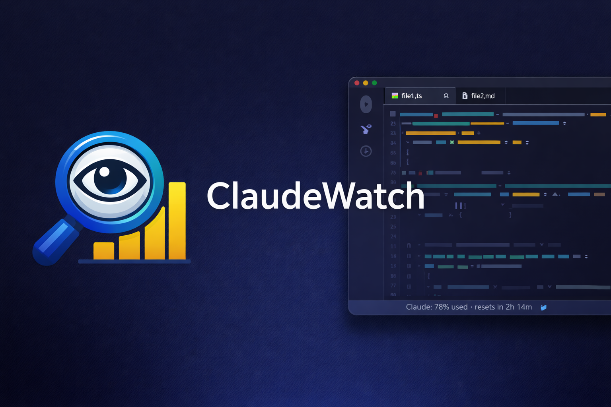

# ClaudeWatch

[](https://github.com/joezuchora/claudewatch/releases/latest)

A companion tool for [Claude Code](https://docs.anthropic.com/en/docs/claude-code) that shows your account usage window data directly in your terminal and VS Code status bar.



## Why

Claude Code doesn't show how much of your usage window you've consumed. ClaudeWatch reads the same credential file Claude Code uses and queries the usage endpoint so you can see your current and weekly utilization at a glance — without leaving your editor or terminal.

## Features

- **Terminal status line** — shows usage inline in Claude Code's built-in status line
- **VS Code extension** — status bar item with color-coded thresholds and hover tooltip
- **Two usage windows** — current (5-hour) and weekly (7-day) utilization percentages
- **Reset timing** — shows when each window resets
- **Stale-while-error** — displays last known good data when refreshes fail
- **Cooldown & retry** — backs off on repeated failures, retries once with a 2s delay
- **No secrets in output** — access tokens never appear in logs, cache, or debug output

## Requirements

- [Bun](https://bun.sh) v1.0+ (build tool and runtime)
- [Claude Code](https://docs.anthropic.com/en/docs/claude-code) installed and signed in (provides credentials)
- Windows or Linux (macOS support planned for v2)

## Install

### Terminal status line

#### Quick install (recommended)

Download and install the latest release automatically:

```bash
curl -fsSL https://raw.githubusercontent.com/joezuchora/claudewatch/main/packages/statusline/install/install.sh | bash
```

Or download manually from the [releases page](https://github.com/joezuchora/claudewatch/releases/latest):

1. Download `claudewatch-linux-x64` (or `claudewatch-windows-x64.exe` on Windows)
2. Copy it to `~/.claude/bin/claudewatch` and make it executable (`chmod +x`)
3. Add to `~/.claude/settings.json`:
   ```json
   { "statusLine": { "type": "command", "command": "~/.claude/bin/claudewatch" } }
   ```

Restart Claude Code. You should see your usage in the status line.

#### Build from source

If you prefer to build from source:

```bash
git clone https://github.com/joezuchora/claudewatch.git
cd claudewatch
bun install
bun run install-statusline
```

### VS Code extension

Download the `.vsix` from the [releases page](https://github.com/joezuchora/claudewatch/releases/latest), then in VS Code: `Ctrl+Shift+P` > `Extensions: Install from VSIX...` > select the downloaded file.

#### Build from source

```bash
git clone https://github.com/joezuchora/claudewatch.git
cd claudewatch
bun install
bun run --filter claudewatch-vscode build
cd packages/vscode
npx @vscode/vsce package --no-dependencies
```

Then in VS Code: `Ctrl+Shift+P` > `Extensions: Install from VSIX...` > select the generated `.vsix` file.

> **Note:** You must run `vsce package` from the `packages/vscode` directory, not the repo root. Running it from the root will fail with `Manifest missing field: engines` because the root `package.json` is not a VS Code extension manifest.

## How it works

```
~/.claude/.credentials.json  -->  ClaudeWatch  -->  Terminal status line
         (read-only)              (core lib)        VS Code status bar
                                     |
                              usage endpoint
                          (undocumented, best-effort)
```

1. Reads the OAuth token from Claude Code's credential file (read-only, never modified)
2. Queries the Anthropic usage endpoint with a 5-second timeout
3. Normalizes the response into a `UsageSnapshot` with both usage windows
4. Caches the result locally (`~/.cache/claudewatch/usage.json`) with a 10-minute TTL
5. Renders the data in the terminal or VS Code status bar

## Terminal output

Default format (width >= 60 chars):
```
⊙ 42% resets 3:00pm · 7d 18% resets sat 7:00am
```

Compact format (width < 60 chars):
```
⊙ 42%
```

Rich format (Claude Code status line with session info):
```
myproject | 45.2k / 200k | 23%
current: ●●●●○○○○○○ 42% | weekly: ●●○○○○○○○○ 18%
Claude 4 Opus | resets 3:00pm | resets sat 7:00am
```

CLI flags: `--json`, `--refresh`, `--debug`, `--version`

## VS Code extension

The status bar shows your primary usage window with color-coded thresholds:

| Utilization | Color |
|---|---|
| < 70% | Default |
| 70-89% | Warning (yellow) |
| 90%+ | Critical (red) |

Hover for a detailed tooltip with both windows, reset times, and freshness status. Click to open the Anthropic usage dashboard.

### Settings

| Setting | Default | Description |
|---|---|---|
| `claudewatch.refreshIntervalSeconds` | `60` | Polling interval (minimum 30s) |
| `claudewatch.warningThresholdPct` | `70` | Yellow threshold |
| `claudewatch.criticalThresholdPct` | `90` | Red threshold |

### Commands

- `ClaudeWatch: Refresh Now` — force an immediate refresh
- `ClaudeWatch: Open Usage Dashboard` — open the Anthropic console

## Error handling

ClaudeWatch is built on an undocumented API endpoint. It handles failures gracefully:

- **Stale data** — if a refresh fails, the last successful data is shown with a "stale" indicator
- **Cooldown** — after certain failures (429, 5xx, network errors), waits 5 minutes before retrying
- **Auth errors** — clearly indicates when credentials are missing, expired, or invalid
- **Degraded mode** — if the API response format changes, shows a warning instead of crashing

## Project structure

```
packages/
  core/           Core business logic (credentials, client, cache, formatting)
  statusline/     Compiled binary for Claude Code's terminal status line
  vscode/         VS Code extension (status bar, tooltip, commands)
```

All domain logic lives in `packages/core`. The statusline and VS Code packages are thin rendering layers.

## Development

```bash
bun install                                        # install dependencies
bun test                                           # run all tests (299 tests)
bun run --filter @claudewatch/core build           # build core
bun run --filter @claudewatch/statusline build     # compile statusline binary
bun run --filter claudewatch-vscode build          # build VS Code extension
```

## Known limitations

- Uses an **undocumented** Anthropic API endpoint — it may change or break without notice
- No macOS support yet (requires Keychain credential integration)
- Not published to the VS Code Marketplace (manual `.vsix` install only)
- No historical data, trends, or burn-rate analytics
- Single-account only

## Contributing

Contributions welcome. The spec is in `SPEC.md` — read it before making architectural changes. All business logic belongs in `packages/core`.

## License

[MIT](LICENSE)
